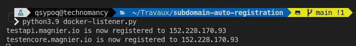

## What's that
This is a new component which integrate into the nginx/docker-gen/letsencrypt-nginx-proxy-companion stack.

## How to use

### Set your registrar auth conf

Example with namecheap:

- Set your conf/namecheap.yml

```yaml
username: "my_username"
api_key: "my_api_key"
whitelisted_ip: "my_whitelisted_ip"
```

### Set your docker-compose environment

- Add environment variables to your docker-compose file

```yaml
version: '3.1'

services:

  persifleur:
    image: persifleur:latest
    restart: always
    ports:
      - 1337:1337
    environment:
      VIRTUAL_HOST: testapi.magnier.io,testencore.magnier.io
      VIRTUAL_PORT: 1337
      LETSENCRYPT_HOST: testapi.magnier.io,testencore.magnier.io
      LETSENCRYPT_EMAIL: myletsencryptmail@tld.io
      REGISTRAR: namecheap
      EXTERNAL_IP: 152.228.170.93

networks:
   default:
     external:
       name: nginx-proxy
```
- Setup the listener

```yaml
version: '3.1'
services:
  subdomain-registrer:
    image: qsypoq/subdomain-auto-registration:latest
    container_name: subdomain-registrer
    restart: unless-stopped
    volumes:
      - /var/run/docker.sock:/var/run/docker.sock:ro
      - ./conf:/usr/src/app/conf:ro

networks:
   default:
     external:
       name: nginx-proxy
```

### Start the listener

```bash
docker-compose up -d
```

### Enjoy
Once the listener is started your A entry will be automatically updated when a container start/restart.



## Credits
Inspired by [docker-gen](https://github.com/nginx-proxy/docker-gen)

Namecheap API script based on [PyNamecheap](https://github.com/Bemmu/PyNamecheap)